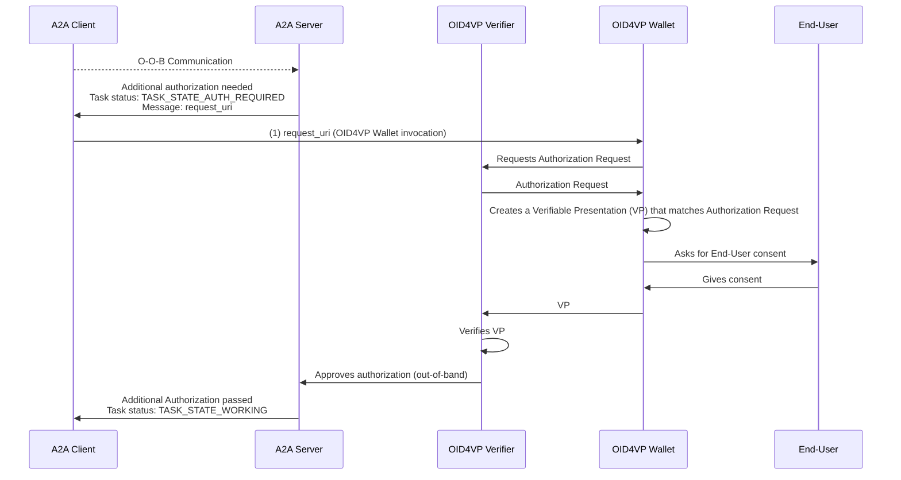

# A2A Protocol Extension: OID4VP In-Task Authentication (v1 Draft)

- **URI:** `https://github.com/a2aproject/a2a-samples/extensions/oid4vp-in-task-auth/v1`
- **Type:** Profile Extension / Data-Only Extension
- **Version:** 1.0.0 (Draft)

## Abstract

This extension provides an option to use [OpenID for Verifiable Presentations (OID4VP) protocol](https://openid.net/specs/openid-4-verifiable-presentations-1_0.html) for Agent2Agent (A2A) In-Task Authentication.

The integration of OID4VP flow allows Server Agents to perform additional authentification by requesting Verifiable Presentations (VPs) from the client.
Such VP-based authorization enables Just-In-Time (JIT) authorization – server can dynamically request specific credentials during a Task execution without breaking the protocol flow.

It's also worth mentioning that support for OID4VP-based auth is highly relevant for adoption of A2A in ecosystems that use / support trust models based on Verifiable Credentials (VCs).

## OID4VP In-Task Authentication Flow

The diagram below shows a non-normative example of an OID4VP A2A in-task authentication flow:



### Assumptions
- The distinction between roles in this flow is logical (OID4VP Verifier can be embedded in A2A Server, etc.)
- (1) OID4VP Wallet invocation is out of scope for this specification
- The diagram assumes usage of `request_uri` for authorization request, but alternative approach with passing authorization request in A2A message is also possible
- Interactions between OID4VP Wallet and OID4VP Verifier are performed according to OID4VP specification and out of scope for this extension

## Protocol Data Definition

An A2A Agent that supports OID4VP In-Task authentication mechanisms **MUST** declare its support in its `AgentCard` under the **`extensions`** part of the `AgentCapabilities` object.

### Example AgentCard Declaration

No additional parameters are required for this extension.

```json
{
  "uri": "https://github.com/a2aproject/a2a-samples/extensions/oid4vp-in-task-auth/v1",
  "required": false,
  "params": {}
}
```

## Data Structure: Authorization Request

The A2A Authorization Request object is passed from Server Agent to the Client to initiate OID4VP flow, data structure is defined according to Section 5 of [RFC9101](https://www.rfc-editor.org/rfc/rfc9101.pdf).
It's included in the `metadata` map of a core A2A message structure as a top-level `authorizationRequest` object.

| Field             | Type     | Required                                                         | Description                                                                                                       |
|:------------------|:---------|:-----------------------------------------------------------------|:------------------------------------------------------------------------------------------------------------------|
| **`client_id`**   | `string` | Yes                                                              | OAuth 2.0 client ID. The value MUST match the `request` or `request_uri` client_id                                |
| **`request_uri`** | `string` | Yes, if `request` is not specified. Otherwise MUST NOT present   | The absolute URI referencing authorization request parameters defined in Section 4 of [RFC6749 (OAuth 2.0)]()     |
| **`request`**     | `object` | Yes, if `request_uri` is not defined. Otherwise MUST NOT present | The Request Object that contains authorization request parameters defined in Section 4 of [RFC6749 (OAuth 2.0)]() |

### Example Authorization Request Payload

```json
{
  "client_id": "client-id",
  "request_uri": "request-uri"
}
```

### Example A2A Message with Authorization Request (Simplified)

This example shows the request body for an A2A `tasks/send` RPC call.

```json
{
  "jsonrpc": "2.0",
  "id": "req-123",
  "method": "tasks/send",
  "params": {
    "message": {
      "messageId": "msg-456",
      "role": "user",
      "parts": [
        {"kind": "text", "content": "Additional authorization is required for this task."}
      ],
      "metadata": {
        "https://github.com/a2aproject/a2a-samples/extensions/oid4vp-in-task-auth/v1": {
          "authorizationRequest": {
            "client_id": "client-id",
            "request_uri": "request-uri"
          }
        }
      }
    }
  }
}
```

## Implementation Considerations

### Wallet Invocation

TODO specify how to provide secure OpenID4VP Wallet invocation from A2A Client. 