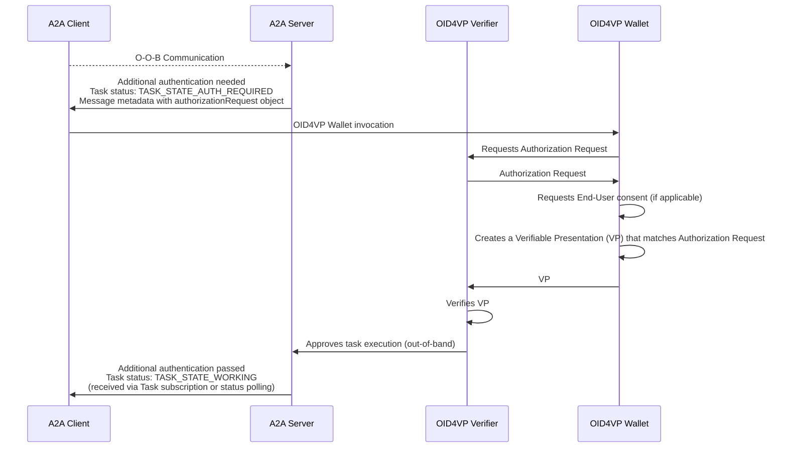

# A2A Protocol Extension: OID4VP In-Task Authentication (v1 Draft)

- **URI:** `https://github.com/DSRCorporation/a2a-oid4vp-in-task-auth-extension/tree/main/v1`
- **Type:** Profile Extension / Data-Only Extension
- **Version:** 1.0.0 (Draft)

## Abstract

This extension provides an option to use [OpenID for Verifiable Presentations (OID4VP) protocol](https://openid.net/specs/openid-4-verifiable-presentations-1_0.html) for Agent2Agent (A2A) In-Task Authentication.

The integration of OID4VP flow allows Server Agents to perform additional authentification by requesting Verifiable Presentations (VPs) from the client.
This mechanism also enables Just-In-Time (JIT) authorization – server can dynamically request information from specific Verifiable Credentials (VCs) during a Task execution without breaking the protocol flow.

It's also worth mentioning that support for OID4VP-based auth is highly relevant for adoption of A2A in ecosystems that use / support trust models based on VCs.

## OID4VP In-Task Authentication Flow

The diagram below shows a non-normative example of an OID4VP A2A in-task authentication flow:



### Assumptions
- The distinction between roles in this flow is logical (OID4VP Verifier can be embedded in A2A Server, etc.)
- OID4VP Wallet invocation is out of scope for this extension, you can find implementation consideration in [corresponding section](#wallet-invocation)
- Requesting End-User consent from a Wallet is out of scope for this extension
- Interactions between OID4VP Wallet and OID4VP Verifier are performed according to OID4VP specification and out of scope for this extension

## Protocol Data Definition

An A2A Agent that supports OID4VP In-Task authentication mechanisms **MUST** declare its support in its `AgentCard` under the **`extensions`** part of the `AgentCapabilities` object.

### Example AgentCard Declaration

The extension requires `oid4vpVersions` parameter that explicitly specifies OID4VP versions supported by the Agent.

```json
{
  "uri": "https://github.com/DSRCorporation/a2a-oid4vp-in-task-auth-extension/tree/main/v1",
  "description": "Provides an option to use OpenID for Verifiable Presentations (OID4VP) for In-Task Authentication",
  "required": false,
  "params": {
    "oid4vpVersions": ["1.0"]
  }
}
```

## Data Structure: Authorization Request

The A2A Authorization Request object is passed from Server Agent to the Client to initiate OID4VP flow, data structure is defined according to Section 5 of [RFC 9101](https://datatracker.ietf.org/doc/rfc9101/).
It's included in the `metadata` map of a core A2A message structure as a top-level `authorizationRequest` object.

| Field             | Type     | Required                                                         | Description                                                                                                                                                     |
|:------------------|:---------|:-----------------------------------------------------------------|:----------------------------------------------------------------------------------------------------------------------------------------------------------------|
| **`client_id`**   | `string` | Yes                                                              | OAuth 2.0 client ID. The value MUST match the `request` or `request_uri` client_id                                                                              |
| **`request_uri`** | `string` | Yes, if `request` is not specified. Otherwise MUST NOT present   | The absolute URI referencing authorization request parameters defined in Section 4 of [RFC 6749 (OAuth 2.0)](https://datatracker.ietf.org/doc/html/rfc6749)     |
| **`request`**     | `object` | Yes, if `request_uri` is not defined. Otherwise MUST NOT present | The Request Object that contains authorization request parameters defined in Section 4 of [RFC 6749 (OAuth 2.0)](https://datatracker.ietf.org/doc/html/rfc6749) |

### Example Authorization Request Payload

```json
{
  "client_id": "client-id",
  "request_uri": "request-uri"
}
```

### Example A2A Message Response with Authorization Request metadata

```json
{
  "task": {
    "id": "task-uuid",
    "status": {
      "state": "TASK_STATE_AUTH_REQUIRED",
      "message": {
        "role": "ROLE_AGENT",
        "parts": [{"text": "Additional authentication is required for this task."}],
        "metadata": {
          "https://github.com/DSRCorporation/a2a-oid4vp-in-task-auth-extension/tree/main/v1": {
            "authorizationRequest": {
              "client_id": "client-id",
              "request_uri": "request-uri"
            }
          }
        }
      }
    }
  }
}
```

## Implementation Considerations

### Wallet Invocation

This specification considers two general cases for Verifiable Credentials (VCs) ownership and A2A Client <-> OID4VP Wallet integration:
- **End-User is a Holder of VCs**, so that A2A Client interacts with a Wallet application controlled by End-User (such as Google or Apple Wallet)
- **A2A Client Agent is a Holder of VCs**, directly controls the Wallet and can present VCs independently

Approaches for the Wallet Invocation process depend on cases described above:

#### End-User is a Holder of VCs

In this scenario, End-User Wallet is a standalone application that needs to be invoked using one of the following mechanisms in accordance with [Section 9 of OID4VP specification](https://openid.net/specs/openid-4-verifiable-presentations-1_0.html#wallet-invocation):
- Custom URL scheme as an `authorization_endpoint` (for example, `openid4vp://`)
- URL (including Domain-bound Universal Links/App link) as an `authorization_endpoint`

If A2A Client and OID4VP Wallet parties are hosted on different devices (cross-device flow), the following options to convey data between devices should be considered:
- OID4VC Wallet can be invoked using the Digital Credentials API as described in [Appendix A of OID4VP specification](https://openid.net/specs/openid-4-verifiable-presentations-1_0.html#dc_api). This option is RECOMMENDED as it provides significant benefits for privacy, security and user experience
- Either of the above mechanisms may be presented as QR-code for the End-User to scan using OID4VC Wallet app or arbitrary camera application on a device

#### A2A Client Agent is a Holder of VCs

This scenario assumes direct control of A2A Client Agent over a Wallet application / module via Model Context Protocol (MCP) or other integration mechanisms.

We can assume the following general flow for Wallet Invocation (simplified):
1. A2A Client Agent receives an Authorization Request from A2A Server
2. A2A Client invokes a Wallet application / module (e.g., by calling MCP tool) and passes `authorizationRequest` object for processing
3. The Wallet proceeds with OID4VP flow, this step may include out-of-band communication with A2A Client Agent (VC selection and confirmation, etc.)

Technical details and further breakdown of this flow are implementation-specific.